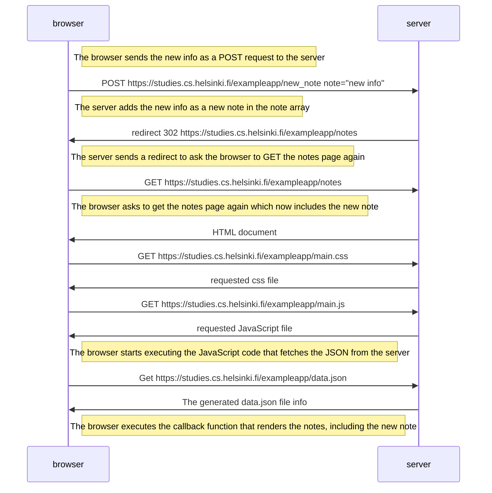

```mermaid
sequenceDiagram
  participant browser
  participant server

  note right of browser: The browser sends the new info as a POST request to the server
  browser->>server: POST https://studies.cs.helsinki.fi/exampleapp/new_note note="new info"
  note right of browser: The server adds the new info as a new note in the note array
  server ->>browser: redirect 302 https://studies.cs.helsinki.fi/exampleapp/notes
  note right of browser: The server sends a redirect to ask the browser to GET the notes page again

  browser ->>server: GET https://studies.cs.helsinki.fi/exampleapp/notes
  note right of browser: The browser asks to get the notes page again which now includes the new note
  server ->>browser: HTML document

  browser ->>server: GET https://studies.cs.helsinki.fi/exampleapp/main.css
  server ->>browser: requested css file

  browser ->>server: GET https://studies.cs.helsinki.fi/exampleapp/main.js
  server ->>browser: requested JavaScript file
  Note right of browser: The browser starts executing the JavaScript code that fetches the JSON from the server

  browser ->>server: Get https://studies.cs.helsinki.fi/exampleapp/data.json
  server ->>browser: The generated data.json file info
  Note right of browser: The browser executes the callback function that renders the notes, including the new note
```
