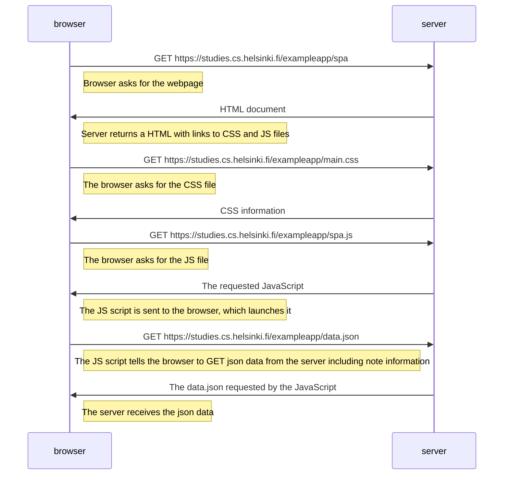

```mermaid
sequenceDiagram
  participant browser
  participant server

  browser->>server: GET https://studies.cs.helsinki.fi/exampleapp/spa
  note right of browser: Browser asks for the webpage
  server ->>browser: HTML document
  note right of browser: Server returns a HTML with links to CSS and JS files

  browser->>server: GET https://studies.cs.helsinki.fi/exampleapp/main.css
  note right of browser:  The browser asks for the CSS file
  server ->>browser: CSS information

  browser->>server: GET https://studies.cs.helsinki.fi/exampleapp/spa.js
  note right of browser: The browser asks for the JS file
  server ->>browser: The requested JavaScript
  note right of browser: The JS script is sent to the browser, which launches it

  browser->>server: GET https://studies.cs.helsinki.fi/exampleapp/data.json
  note right of browser: The JS script tells the browser to GET json data from the server including note information
  server ->>browser: The data.json requested by the JavaScript
  note right of browser: The server receives the json data
```
