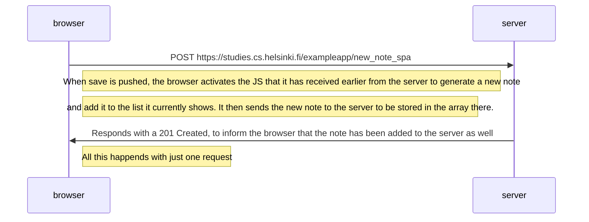

```mermaid
sequenceDiagram
  participant browser
  participant server

  browser->>server: POST https://studies.cs.helsinki.fi/exampleapp/new_note_spa
  note right of browser: When save is pushed, the browser activates the JS that it has received earlier from the server to generate a new note 
note right of browser: and add it to the list it currently shows. It then sends the new note to the server to be stored in the array there.
  server ->>browser: Responds with a 201 Created, to inform the browser that the note has been added to the server as well
  note right of browser: All this happends with just one request
```
